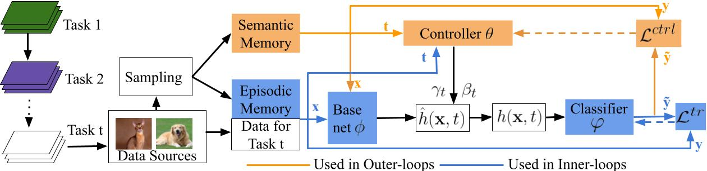

# CONTEXTUALTRANSFORMATIONNETWORKS FORONLINECONTINUALLEARNING

This project contains the implementation of the following ICLR 2021 paper: 

**Title:** Contextual Transformation Networks for Online Continual Learning (ICLR 2021). [[openreview]](https://openreview.net/forum?id=zx_uX-BO7CH), [[pdf]](https://openreview.net/pdf?id=zx_uX-BO7CH).

**Authors:** [Quang Pham](https://sites.google.com/view/quangpham93), [Chenghao Liu](https://sites.google.com/view/liuchenghao/home), [Doyen Sahoo](https://scholar.google.com.sg/citations?user=A61jJD4AAAAJ&hl=en), and [Steven Hoi](https://sites.google.com/view/stevenhoi/home)

CTN proposes a novel network design with a controller that can efficiently extract task-specific features from a base network. Both the base network and the controller have access to their own memory units and are joinly trained via a bilevel optimization strategy.



# Requirements
- Pytorch 1.5.0
- CUDA 10.2

All experiments in this work was run on a single K80 GPU with 12Gb memory.

# Benchmarks
### 1. Prepare data
Follow the instructions in the `data/` folders to prepare the benchmarks.

### 2. Run experiments
To replicate our results on the Permuted MNIST, Split CIFAR100, CORE50, and Split miniImagenet, run
```
chmod 777 scripts/run.sh
./scripts/run.sh
```

The results will be put in the `resuts/` folders.

### 3. Parameter Setting
The provided script `scripts/run.sh` includes the best hyper-parameter cross-validated from the cross-validation tasks. The following is the list of parameters you can experiment with

| Parameter           | Description                                                  | Values |
| :------------------ | :----------------------------------------------------------- | :-------------------------------------------------------- |
| **data_path** | path where the data sets are saved | e.g. `data/` |
| **data_file** | name of the data file | e.g. `mnist_permutations.pt` |
| **use** | randomly use a subset of data. When `use < 1`, `use%` of the original data, when `use > 1`, select `use` samples from the data | e.g. `0.5` (select 50% of data), `1000` (select 1000 data samples) |
|**n_memories**| number of data stored per task | e.g. `50` |
|**memory_strength**| value of the regularizer's coefficient | e.g. `100` |
|**temperature**| temperature of the softmax in knowledge distillation | e.g. `5`|
|**lr**| (inner) learning rate | e.g. `0.1` |
|**beta**| (outer) learning rate  | e.g. `0.3` |
|**inner_steps**| number of SGD udpates per samples | e.g. `2` | 
|**n_meta**| number of outer updates per samples | e.g. `2` |
|**n_val**| percentage of the total memory used for the semantic memory (in CTN) | e.g. `0.2` | 
|**replay_batch_size**| number of data in the memory used per experience replay step | e.g. `64` | 

# Cite
If you found CTN useful for your research, please consider citing.
```
@inproceedings{pham2020contextual,
  title={Contextual transformation networks for online continual learning},
  author={Pham, Quang and Liu, Chenghao and Sahoo, Doyen and Steven, HOI},
  booktitle={International Conference on Learning Representations},
  year={2021}
}
```

# Acknowledgement
This project structure is based on the [GEM](https://github.com/facebookresearch/GradientEpisodicMemory) repository with additional methods, metrics and implementation improvements. For the CORe50 benchmark, we modify the data loader from [MIR](https://github.com/optimass/Maximally_Interfered_Retrieval).
* https://github.com/facebookresearch/GradientEpisodicMemory
* https://github.com/optimass/Maximally_Interfered_Retrieval
